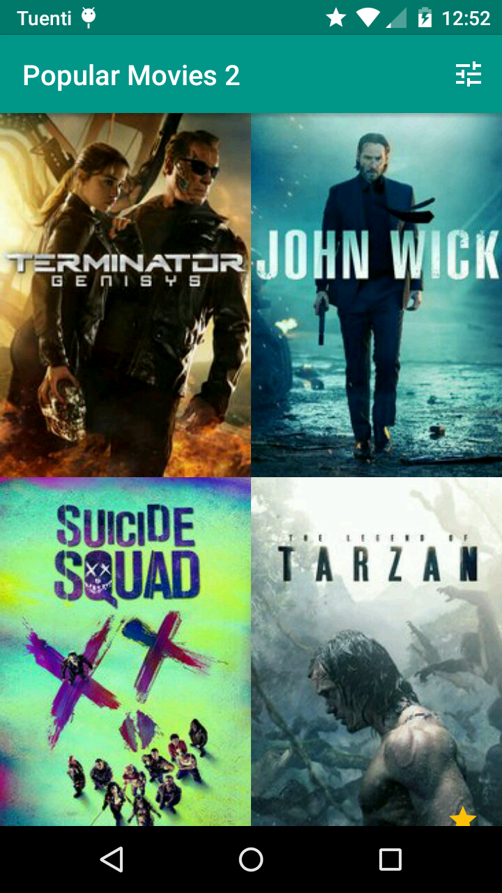
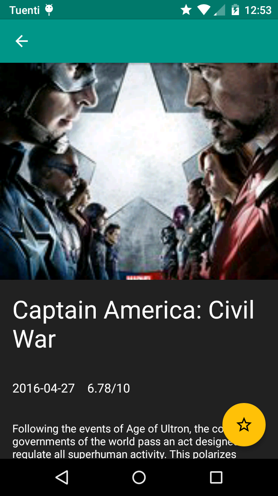
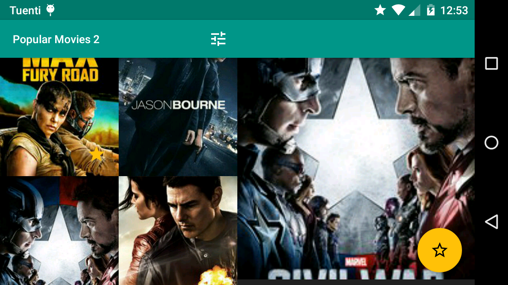

# Popular Movies

An Android app that displays movies. It's the project Popular Movies (Stage 2) of the Udacity's [Android Developer Nanodegree](https://www.udacity.com/course/android-developer-nanodegree-by-google--nd801).

It uses the libraries Dagger 2, Retrofit 2, RxJava 1 and AutoValue, among others.

It's built using the Model-View-Presenter pattern.

It caches data locally using an SQLite database and the libraries SQLBrite and SQLDelight, so that it can work fully offline.

Additionally, it has a master-detail UI adapted for tablets.

You can sort the movies by rating or by popularity, and add them to favorites.

## The Movie DB API Key

To use the app you'll need an API Key for [www.themoviedb.org](https://www.themoviedb.org/). The app
expects an `string` resource named `movie_db_api_key` with the API key as it's value. Add a file
(which could be named, for example, `keys.xml`) into the folder `app/src/main/res/values` with an
`string` resource, like this:

```xml
<resources>
    <string name="movie_db_api_key">c349e4d167ged7yge44d760630cf7e1</string>
</resources>
```

## Screenshots

#### Main Activity



<br>

#### Detail Activity



<br>

#### Master Detail


